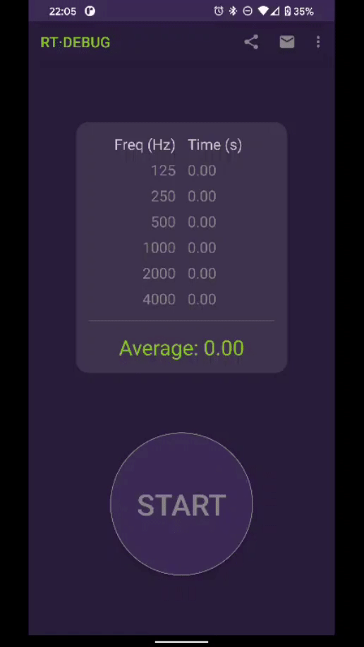

# RT
App for measuring Reverb Time in octaves or average in a really easy way.

Steps:
1. Press START.
2. Clap your hands after the countdown (measuring step).
3. See results

To achieve optimum results, it is highly recommended trying to locate the device away from reflective surfaces and clap stick farther from the critical radius, so that the sound reverberated outweighs the direct one.

Install it on [Google Play](https://play.google.com/store/apps/details?id=com.appacoustic.rt).

More info on [AppAcoustiC](http://appacoustic.com/).
